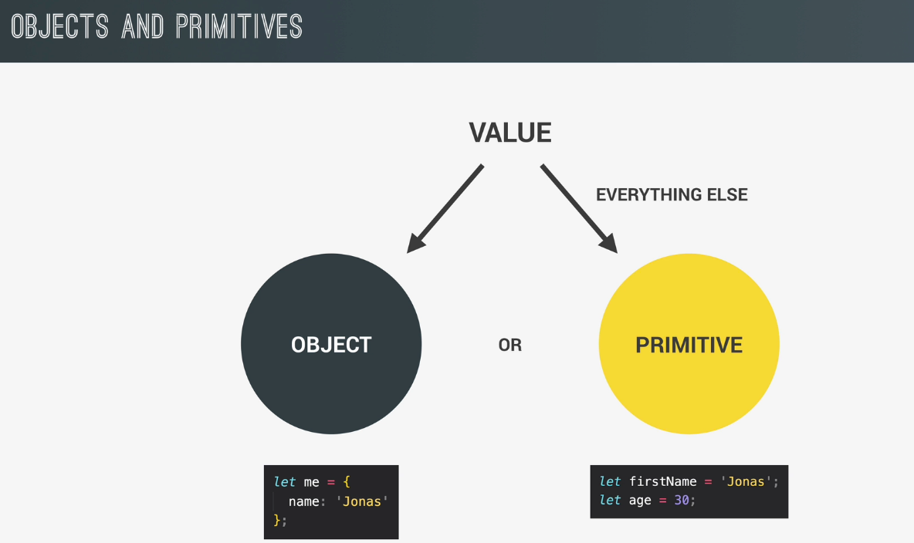

# The Complete Javascript Course 2022 - From Zero to Expert!

Jonas Udemy - Update 2022

## 1. Javascript Fundamentals - Part 1

Learning the very basic of the `js` language

- Variables
- Data types
- Operators
- If/else statement
- ...

### 1.1. `Hello World!`

```js
console.log('Hello World');
```

### 1.2. A brief introduction to JavaScript

What is JavaScript?

> Javascript is a high-level object-oriented, multi-paradigm programming language

- Programming language: instruct computer to do things
- High-level: we don't have to worry about complex stuff like memory management
- Object-oriented: based on objects, for storing most kinds of data
- Multi-paradigm: we can use different styles of programming, such as `imperative` and `declarative`


There is nothing you can't do with JS (well almost ...)

- Dynamic effects and web applications in the browser: `react`, `angular`, `vue`,... (`front-end apps`)
- Web applications on web server: `nodejs` (`back-end apps`)
- Native mobile applications: `react native`, `ionic`
- Native desktop applications: `electron`

### 1.3. Values and Variables

A `value` is basically a `piece of data`

```js
console.log('jonas');
console.log(22);
console.log(true);
```

A `value` can be stored in a `variable`

```js
let firstName = 'jonas';

console.log(firstName);
console.log('Hello ' + firstName);
```

Some `conventions` and `rules` for naming `variable`

- camelCase
- can not start with a `number`
- reserved keyword in `js`
- uppercase variable for `constant`
- variable name must be descriptive

### 1.4. Data types



The 7 primitive data types


### 1.5. Declare variables

Using `let` for declaring a variable that can be changed later. In the below
example, we `reassign` value to the existing `variable`, or we `mutate` the
`variable`

```js
let age = 30;
age = 31;

console.log(age);
```

Using `const` for declaring variable that are not supposed to change at any
point in the future. Or we declare an `immutable` `variable`

```js
const PI = 3.14;
console.log(PI);
```

Always recommend to use `const` by default and `let` only when you are
really sure that the `variable` needs to change at some point
in the future

`var` is the old way of defining variables, prior to `ES6`

### 1.6. Basic Operators

> An operator basically allows us to transform values or combine multiple values,
> and really do all kinds of work with values

- Mathematical operators: `+`, `-`, `*`, `/`, `**`
- Comparision operators: `>`, `<`, `==`, `===`, `>=`, `<=`
- Logical operators
- Assignment operators: `=`, `+=`, `-=`, `*=`, `/=`, `++`, `--`
- ...

Operator precedence

### 1.7. Strings and template literals

With template literals, we can write string in a more normal way,
and then basically insert the variables directly into the string and then
they will simply be replaced

So basically a template literal can assemble multiple pieces into one final
string

```js
const firstName = 'hieu';
console.log(`Hello ${firstName}`);
```

Useful in building multiple line string

```js
const s1 =
  'String with \n\
multiple \n\
lines';

const s2 = `String with
multiple
lines`;
```

### 1.8. Taking decisions

```js
const age = 19;

const isOldEnough = age >= 19;

if (isOldEnough) {
  //
} else {
  //
}
```

### 1.9. Type conversion & Coercion

`type conversion` is when we manually convert from one type to another

```js
const inputYear = '2000';

console.log(Number(inputYear)); // 2000
console.log(Number('Hello')); // NaN
```

`type coercion` is when `js` automatically converts types behind the scenes for us

```js
console.log('I am ' + 23 + ' years old');
console.log('I am ' + String(23) + ' years old');
console.log('23' - '10' - 3); // 10
console.log('23' + '10' + 3); // '23103'
```

### 1.10. Truthy & Falsy values

`Falsy` values are values that are not exactly `false`, but will become `false`
when we try to convert them into a `boolean`

`5` `falsy` values in `js`

- `0`
- `''`
- `undefined`
- `null`
- `NaN`

Everything else are our so-called `truthy` values

```js
console.log(Boolean(0));
console.log(Boolean(undefined));
console.log(Boolean(''));
console.log(Boolean(null));
console.log(Boolean(NaN));
```

### 1.11. Equality Operators `==` vs `===`

- `===` is called the `strict equality` operator, it does not perform `type coercion`
- `==` is called the `loose equality` operator, it actually does perform `type coercion`

Rule of thumb: Avoid the loose equality operator as much as you can

### 1.12. Boolean logic

`boolean logic` is a branch of computer science, which uses `true` and `false`
values to solve complex logical problems

- `and`: `true` when `ALL` are `true`
- `or`: `true` when `ONE` is `true`
- `not`: inverts `true/false` value

### 1.13. Logical operators

```js
const hasDriverLicense = true;
const hasGoodVision = true;

if (hasDriverLicense && hasGoodVision) {
  // ok
}

if (hasDriverLicense || hasGoodVision) {
  // ok
}

if (!hasDriverLicense) {
  // not ok
}
```

### 1.14. The `switch` statement

An alternative way of writing a complicated `if/else` statement

```js
const day = 'monday';

switch (day) {
  case 'monday': // day === 'monday'
    break;

  case 'tuesday': // day === 'tuesday'
    break;

  case 'wednesday': // day === 'wednesday'
    break;

  case 'thursday':
  case 'friday':
    break;

  default:
    break;
}
```

### 1.15. `statement` & `expression`

An `expression` is a piece of code that **produces a value**

```js
3 + 4; // expression
2000; // expression
true & false & !false; // expression
'hello' + ' ' + 'world';
```

A `statement` is like a bigger piece of code that is executed and which
does not produce a value of itself

A `statement` is like a `complete` sentence and `expressions` are like the words
that make up the sentences

Now basically, we write our whole programs as a sequence of actions. And these
actions are `statements`

Now this difference between `expressions` and `statements` is importance
to know because `js` expects statements and expressions in different places

For example, in a `template literal`, we can only insert `expressions`, but not
`statements`

### 1.16. The conditional (`ternary`) operator

```js
const age = 23;

console.log(age > 18 ? 'I like to drink wine' : 'I like to drink water');
```
